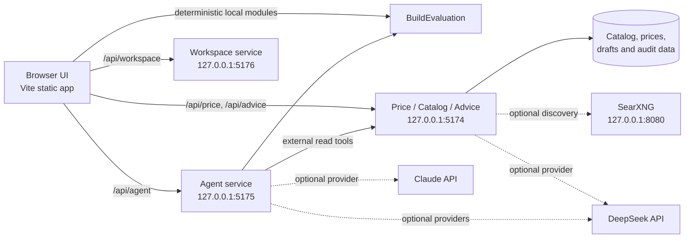

# Build Sim

[English](./README.md) | [简体中文](./README.zh-CN.md)

Build Sim is an evidence-aware PC and NAS build simulator. It combines exact-SKU configuration, deterministic compatibility checks, spatial occupancy, cable routing, assembly planning, thermal and noise estimates, auditable price snapshots, governed official-catalog enrichment, and an optional provider-neutral AI agent in one browser application.

The current `0.2.0-alpha` release focuses on the JONSBO N6 platform with the ASUS Pro WS W680M-ACE SE and Intel Core i5-14500 reference path. The architecture is designed for additional cases and desktop builds, but those profiles are not shipped yet.

> Build Sim is a planning tool, not manufacturer CAD, CFD, electrical certification, or a substitute for checking the latest manuals. Reconstructed geometry, estimated airflow, market candidates, OCR output, and AI responses remain visibly separate from official facts.

## Table of contents

- [Project status](#project-status)
- [Platform capabilities](#platform-capabilities)
- [Architecture](#architecture)
- [Requirements](#requirements)
- [Quick start](#quick-start)
- [Full local deployment](#full-local-deployment)
- [Production deployment](#production-deployment)
- [Configuration](#configuration)
- [How to use the platform](#how-to-use-the-platform)
- [API overview](#api-overview)
- [Data, evidence, and security](#data-evidence-and-security)
- [Testing](#testing)
- [Repository layout](#repository-layout)
- [Known limits and roadmap](#known-limits-and-roadmap)
- [Contributing and license](#contributing-and-license)

## Project status

Build Sim is usable as a local alpha and is under active development.

| Area | Current status |
| --- | --- |
| Deterministic build evaluation | Implemented and shared by the UI, Advice service, and Agent tools |
| Plan lifecycle workspace | Implemented: template or Agent blank initialization, autosave, duplicate, switch, immutable versions, restore, soft delete, and offline cache |
| Plan-linked transactions and build tasks | Implemented with exact item links, stable task source references, reconciliation, and traceable checklist export |
| Evidence-aware Three.js scene | Implemented with SVG fallback, findings, routing, dimensions, thermal planning overlays, and assembly workflow |
| JONSBO N6 geometry, fit, wiring, routing, and assembly | Implemented for the current case profile |
| Thermal, noise, power, and price planning | Implemented with explicit estimate/provenance boundaries |
| Price and official-catalog service | Implemented as a loopback-only local service |
| DeepSeek Advice and Agent adapters | Implemented; bounded live DeepSeek smoke has been verified |
| Claude adapter | Protocol fixture verified; live provider behavior is not verified |
| Governed catalog write | One approval-bound write tool is implemented; writes are disabled by default |
| Public multi-user hosting | Not ready: authentication, tenancy, and application-level rate limiting are not included |
| Full application container deployment | `deploy/osaka/` includes the Web, Price/Advice, Agent, and SearXNG Compose stack; Kubernetes manifests are not included |
| License | No `LICENSE` file is present yet; resolve this before advertising a public release |

## Platform capabilities

### Deterministic build model

- Exact SKU catalog backed by `data/skus/catalog.json`.
- A single `BuildEvaluation` result drives compatibility, power, thermal, noise, pricing, physical, and calibration views.
- Volumetric AABB occupancy checks use the case-local millimetre coordinate system in `data/cases/jonsbo-n6/geometry.json`.
- Evidence-aware verdicts prevent reconstructed anchors from being presented as measured manufacturer geometry.
- Configuration export/import makes a build reproducible and shareable.

### Spatial fit and assembly

- Isometric component envelopes, case chambers, trays, backplane, PSU rack, and removable bracket.
- GPU, cooler, PSU, memory, drive, and connector clearance checks.
- Derived assembly order from mounting dependencies, insertion corridors, and connector access.
- Manual-declared steps remain distinct from geometry-derived steps.

### Wiring and routing

- Per-drive data paths, backplane power feeds, cable checklist, and modular PSU socket plan.
- Port-count-aware HBA/motherboard routing and separate cable accounting for SFF-8643 and SFF-8654.
- Waypoint-graph cable routing with length, slack, orientation, opening, and access checks.
- Selectable routing polylines in the spatial view.

### Thermal, acoustics, and power

- Chamber air-temperature estimate based on heat load and effective airflow.
- Component heat field interpolated from the same deterministic result used by the UI.
- Drive-bay and lower-chamber coupling are bounded estimates, not CFD.
- Power budget, fan planning, and noise estimates are surfaced with their assumptions.

### Price and official catalog

- Auditable dated price snapshots under `data/prices/`.
- Local collection workflow for JD, Taobao, Pinduoduo, Amazon, and official product pages.
- Candidate discovery, detail-page variant inspection, plausibility gates, and explicit user confirmation.
- Trusted-domain registry, SSRF protection, bounded redirects and payloads, HTML/JSON-LD/spec-table/PDF extraction, optional scanned-PDF OCR, and field-level provenance.
- Unknown official domains become proposals; discovered candidates, review drafts, and committed catalog facts remain separate states.

### Advice and Agent

- Optional DeepSeek-backed structured build advice with local usage and estimated-cost audit records.
- Provider-neutral, streaming multi-turn Agent service with persistent local sessions, cancellation, Skills, Tools, definition hashes, and tamper-evident audit records.
- Seven local read/proposal tools, five external-read tools, and one governed write tool (`enrich_official_catalog`).
- Built-in Skills: `plan-initializer`, `build-diagnosis`, `upgrade-advisor`, `shopping-research`, and `assembly-and-wiring`.
- **Use Agent to initialize** creates a pending plan whose valid config is explicitly an internal rendering scaffold. The Agent collects intent, selects exact governed catalog SKU ids, and can only return an atomic initialization proposal that requires whole-proposal human approval.
- Tool schemas, budgets, allowed-tool restrictions, loopback service boundaries, and out-of-band write approval are enforced server-side.

### Browser interface

The current interface contains seven plan-scoped working areas:

1. **Workspace** — create, duplicate, switch, archive, restore, and inspect the next tasks for independent plans.
2. **Plan editor and evaluation** — edit the active draft and save immutable, hash-bound versions.
3. **Spatial view** — inspect the evidence-aware Three.js scene, findings, routes, dimensions, thermal planning, and assembly steps; SVG remains the fallback.
4. **Purchases and transactions** — review staged OCR, link exact plan items, archive evidence, and manage privacy deletion.
5. **Build execution** — reconcile purchase, assembly, wiring, and verification tasks by stable source reference.
6. **Agent** — read the active plan/3D/evaluation/purchase/task context and propose allowlisted changes; only explicit human approval can mutate the draft.
7. **Legacy detail panels** — retain thermal, wiring, GPU, price, and checklist detail through a documented compatibility adapter while migration continues.

## Architecture



The frontend, price service, and Agent service are separate processes. During development, Vite proxies the API paths. In production, serve `dist/` as static files and proxy selected API routes to the two loopback services.

## Requirements

- Node.js 20 or newer.
- npm with lockfile-compatible `npm ci` support.
- A modern browser.
- Optional for local development, required for the Osaka profile: Docker with Compose.
- Optional: Playwright Chromium for headed marketplace collection and browser smoke tests.
- Optional: server-side DeepSeek or Claude credentials. Never expose these through a `VITE_` variable.

## Quick start

```bash
git clone <your-fork-or-repository-url> build-sim
cd build-sim
npm ci
cp .env.example .env.local
```

Start the workspace service in a second terminal and open `http://127.0.0.1:5173`:

```bash
npm run workspace:serve
npm run dev
```

The deterministic simulator does not require an AI key.

Run the supporting services in separate terminals when their features are needed:

```bash
npm run price:serve
npm run agent:serve
```

The Agent stays disabled until a provider and `BUILD_SIM_AGENT_ENABLED=true` are configured.

## Full local deployment

### 1. Install and configure

```bash
npm ci
cp .env.example .env.local
```

Configuration is merged per key in this order:

```text
process.env > .env.local > .env > .env.example
```

An explicitly empty higher-priority value clears the setting rather than falling back. Keep `.env.local` private; it is ignored by Git.

### 2. Start the price, catalog, and Advice service

```bash
npm run price:serve
```

It listens on `127.0.0.1:5174` by default. Price snapshots and deterministic catalog operations work without an AI provider.

To enable DeepSeek Advice, edit `.env.local`:

```dotenv
DEEPSEEK_ENABLED=true
BUILD_SIM_ADVICE_ENABLED=true
DEEPSEEK_API_KEY=<server-side-key>
```

Do not prefix the key with `VITE_`. Provider calls may incur charges. The application records token usage and a local estimated cost; that estimate is not the provider invoice or account balance.

Transaction screenshots use DeepSeek's public vision model by default. It reuses the server-only `DEEPSEEK_API_URL` and `DEEPSEEK_API_KEY`; optional OCR-specific values override them:

```dotenv
TRANSACTION_OCR_PROVIDER=deepseek-ocr
DEEPSEEK_OCR_API_URL=
DEEPSEEK_OCR_MODEL=deepseek-v4-flash-vision-exp
DEEPSEEK_OCR_API_KEY=
```

The screenshot is sent only to the configured DeepSeek endpoint and is not persisted in the catalog; the app retains a content hash, redacted summary, engine id, provider usage, and local cost estimate. OCR failures are explicit and never silently switch engines. A self-hosted vLLM `deepseek-ai/DeepSeek-OCR` endpoint remains supported by setting its URL and model explicitly. Set `TRANSACTION_OCR_PROVIDER=tesseract` only for an intentional rollback to bundled English recognition.

### 3. Start the Agent service

For DeepSeek:

```dotenv
BUILD_SIM_AGENT_ENABLED=true
DEEPSEEK_ENABLED=true
DEEPSEEK_API_KEY=<server-side-key>
DEEPSEEK_AGENT_MODELS=deepseek-v4-flash,deepseek-v4-pro,deepseek-v4-flash-vision-exp
```

Then run:

```bash
npm run agent:serve
```

For Claude, also set `CLAUDE_ENABLED=true` and `CLAUDE_API_KEY`. Claude remains optional and its current validation boundary is protocol fixtures rather than a live-provider acceptance run.

### 4. Start the frontend

```bash
npm run dev
```

The Vite development server reads the same service-port configuration and proxies Price/Advice and Agent requests. All application services bind to `127.0.0.1`; a port collision fails explicitly.

### 5. Optional local SearXNG discovery

The bundled Compose file is for SearXNG only, not the full application:

```bash
npm run searxng:up
npm run searxng:health
npm run searxng:smoke
```

Enable it in `.env.local`:

```dotenv
CATALOG_DISCOVERY_PROVIDER=searxng
SEARXNG_BASE_URL=http://127.0.0.1:8080
```

Stop it with:

```bash
node scripts/searxng-local.mjs stop
```

Search titles and snippets are discovery evidence only. A fact is not official until a trusted final URL has been fetched, extracted, reviewed, and accepted through the catalog gates.

### 6. Optional scanned-PDF OCR

OCR is local, English-only, bounded, disabled by default, and never promotes text directly into formal catalog facts:

```dotenv
CATALOG_PDF_OCR_ENABLED=true
CATALOG_PDF_OCR_MIN_TEXT_CHARS=80
CATALOG_PDF_OCR_MAX_PAGES=3
CATALOG_PDF_OCR_WIDTH=1600
CATALOG_PDF_OCR_TIMEOUT_MS=60000
```

OCR-derived fields require review and retain OCR provenance. The code rejects values outside the hard safety limits.

### 7. Optional marketplace browser

Install Chromium if Playwright has not downloaded it:

```bash
npx playwright install chromium
npm run price:login
```

The login profile is stored under `.cache/` and must not be committed. Respect each marketplace's terms, access controls, and rate limits.

## Production deployment

The repository includes a complete single-host Docker Compose profile under `deploy/osaka/`. It builds the static Web image and the shared Node.js runtime image, then runs Web, Price/Catalog/Advice, Agent, Workspace, and a pinned SearXNG image. Kubernetes manifests and an automated public deployment pipeline are not included.

### Docker Compose on Osaka

The checked-in profile expects the repository at `/home/linuxuser/Code/build-sim`. Application ports remain loopback-only; host Nginx is the TLS and access-control boundary.

#### 1. Prepare the host and environment

```bash
sudo mkdir -p /home/linuxuser/Code
sudo chown linuxuser:linuxuser /home/linuxuser/Code
git clone <your-repository-url> /home/linuxuser/Code/build-sim
cd /home/linuxuser/Code/build-sim

cp deploy/osaka/env.remote.example .env.remote
chmod 600 .env.remote
mkdir -p runtime deploy-backups
chmod 700 runtime
```

For a private or uncommitted working tree, synchronize the source over SSH instead of cloning, while excluding `.git`, `.env*`, `node_modules/`, `dist/`, and runtime/audit data. Copy secrets separately with mode `600`.

Edit `.env.remote` on the server. Replace `SEARXNG_SECRET=<generate-on-server>` with a random value and keep all provider keys server-side. The Compose services read `.env.remote`, not `.env.local`. When promoting a local provider configuration, merge only the provider keys; do not overwrite deployment-owned ports, loopback URLs, or runtime paths.

DeepSeek Advice and Agent require all of these values:

```dotenv
DEEPSEEK_ENABLED=true
BUILD_SIM_ADVICE_ENABLED=true
BUILD_SIM_AGENT_ENABLED=true
DEEPSEEK_API_KEY=<server-side-key>
```

Provider requests may transfer build/session data externally and incur charges. Copying a key does not validate provider connectivity; use a separately authorized bounded request for that acceptance check.

#### 2. Build and start

Run from the repository root:

```bash
docker compose -f deploy/osaka/compose.yaml config --quiet
docker compose -f deploy/osaka/compose.yaml build
docker compose -f deploy/osaka/compose.yaml up -d
docker compose -f deploy/osaka/compose.yaml ps
```

The profile uses these loopback listeners:

| Service | Listener |
| --- | --- |
| Web container | `127.0.0.1:15176` |
| Price / Catalog / Advice | `127.0.0.1:5174` |
| Agent | `127.0.0.1:5175` |
| Workspace / Plan repository | `127.0.0.1:5176` |
| SearXNG | `127.0.0.1:18080` |

#### 3. Configure Nginx and HTTPS

The profile includes a temporary HTTP configuration for certificate issuance and the final TLS reverse proxy:

```bash
sudo cp deploy/osaka/nginx-build-sim-http.conf /etc/nginx/sites-available/build-sim
sudo ln -sfn /etc/nginx/sites-available/build-sim /etc/nginx/sites-enabled/build-sim
sudo nginx -t
sudo systemctl reload nginx

sudo certbot certonly --nginx -d build-sim.66-245-218-148.sslip.io
sudo htpasswd -c /etc/nginx/.htpasswd-build-sim buildsim
sudo chown root:www-data /etc/nginx/.htpasswd-build-sim
sudo chmod 640 /etc/nginx/.htpasswd-build-sim

sudo cp deploy/osaka/nginx-build-sim.conf /etc/nginx/sites-available/build-sim
sudo nginx -t
sudo systemctl reload nginx
```

The final proxy exposes only the UI, Price/Advice/Agent routes, catalog search polling, and candidate enrichment. Other `/api/catalog/` administration routes return `404`. The supplied hostname is specific to the current Osaka address; change the `server_name` and certificate paths together when deploying elsewhere.

#### 4. Verify, update, and stop

```bash
curl --fail http://127.0.0.1:15176/healthz
curl --fail http://127.0.0.1:5174/api/price/health
curl --fail http://127.0.0.1:5175/api/agent/health
curl --fail http://127.0.0.1:5176/api/workspace/plans
docker compose -f deploy/osaka/compose.yaml logs --tail=100
```

After syncing a new source tree or changing `.env.remote`:

```bash
docker compose -f deploy/osaka/compose.yaml build
docker compose -f deploy/osaka/compose.yaml up -d --force-recreate
```

For a repeatable manual release, use the checked-in deployment script. With no argument it deploys the current checkout; `--ref` fetches `origin/main`, verifies that the requested commit belongs to it, and deploys that exact commit:

```bash
./deploy/osaka/deploy.sh
./deploy/osaka/deploy.sh --ref <full-commit-sha>
```

The script refuses tracked local changes, validates Compose, preserves `.env.remote` and `runtime/`, backs up the current Web and Runtime images, recreates the stack, and checks Web, Price, Agent, Workspace, and SearXNG. A failed build or health check restores the previous Git commit and image tags.

Stop the stack without deleting the bind-mounted `runtime/` data:

```bash
docker compose -f deploy/osaka/compose.yaml down
```

An HTTP health response proves only the process and proxy layers. Validate the authenticated public origin, one deterministic build evaluation, persistence, and—only when explicitly authorized—one bounded provider request before claiming full provider delivery.

### Manual systemd deployment (alternative)

#### 1. Build artifacts

```bash
npm ci
npm run test
npm run build
```

The build creates:

- `dist/` — static frontend assets.
- `dist-agent/agent-server.js` — bundled Agent server.
- The Price/Catalog/Advice service runs from `scripts/price-server/server.mjs`.

`npm run preview` is useful for local frontend verification; it is not a production API gateway.

#### 2. Host layout and environment

The examples below use `/opt/build-sim`:

```bash
sudo mkdir -p /opt/build-sim
sudo chown "$USER" /opt/build-sim
git clone <your-repository-url> /opt/build-sim
cd /opt/build-sim
npm ci
cp .env.example .env.local
npm run build
```

Set production secrets and feature flags in `/opt/build-sim/.env.local` or in the service manager. The service `WorkingDirectory` must be the project root so the shared environment loader can find the files and relative data paths.

#### 3. systemd services

Price/Catalog/Advice service:

```ini
# /etc/systemd/system/build-sim-price.service
[Unit]
Description=Build Sim Price Catalog and Advice Service
After=network.target

[Service]
Type=simple
User=build-sim
Group=build-sim
WorkingDirectory=/opt/build-sim
ExecStart=/usr/bin/node scripts/price-server/server.mjs
Restart=on-failure
RestartSec=3
NoNewPrivileges=true
PrivateTmp=true

[Install]
WantedBy=multi-user.target
```

Agent service:

```ini
# /etc/systemd/system/build-sim-agent.service
[Unit]
Description=Build Sim Agent Service
After=network.target build-sim-price.service

[Service]
Type=simple
User=build-sim
Group=build-sim
WorkingDirectory=/opt/build-sim
ExecStart=/usr/bin/node dist-agent/agent-server.js
Restart=on-failure
RestartSec=3
NoNewPrivileges=true
PrivateTmp=true

[Install]
WantedBy=multi-user.target
```

After creating a dedicated `build-sim` user and applying correct ownership:

```bash
sudo systemctl daemon-reload
sudo systemctl enable --now build-sim-price build-sim-agent
sudo systemctl status build-sim-price build-sim-agent
```

If the Agent is disabled, do not start or expose the Agent unit.

#### 4. Nginx static hosting and API proxy

```nginx
server {
    listen 443 ssl http2;
    server_name build-sim.example.com;

    root /opt/build-sim/dist;
    index index.html;

    location / {
        try_files $uri $uri/ /index.html;
    }

    location /api/price/ {
        proxy_pass http://127.0.0.1:5174;
        proxy_set_header Host $host;
        proxy_set_header X-Forwarded-Proto $scheme;
    }

    location /api/advice/ {
        proxy_pass http://127.0.0.1:5174;
        proxy_set_header Host $host;
        proxy_set_header X-Forwarded-Proto $scheme;
    }

    location /api/agent/ {
        proxy_pass http://127.0.0.1:5175;
        proxy_http_version 1.1;
        proxy_buffering off;
        proxy_read_timeout 300s;
        proxy_set_header Host $host;
        proxy_set_header X-Forwarded-Proto $scheme;
    }
}
```

Do not expose `/api/catalog/` administration and write routes to an untrusted network. Before public hosting, add authentication, authorization, tenant isolation where needed, request/body limits, rate limiting, TLS, security headers, log rotation, backups, and monitoring at the reverse proxy or a trusted gateway. The application itself is currently designed for a trusted local/single-user environment.

#### 5. Production checks

```bash
curl --fail http://127.0.0.1:5174/api/price/health
curl --fail http://127.0.0.1:5175/api/agent/health
curl --fail https://build-sim.example.com/
```

Also verify an actual build evaluation and, when enabled, one bounded Agent request through the public origin. A healthy process alone does not prove that proxying, credentials, persistence, or provider calls work.

## Configuration

### Ports

| Variable | Default | Owner |
| --- | ---: | --- |
| `WEB_SERVER_PORT` | `5176` | Vite development server |
| `WEB_PREVIEW_PORT` | `4173` | Vite preview server |
| `PRICE_SERVER_PORT` | `5174` | Price/Catalog/Advice service and its consumers |
| `AGENT_SERVER_PORT` | `5175` | Agent service and Vite proxy |

All four defaults are examples, not externally exposed listeners. The application servers bind to loopback.

### Providers and Agent budgets

See [`.env.example`](./.env.example) for the complete list. Important groups include:

- `DEEPSEEK_*`, `CLAUDE_*`, and their server-side API keys.
- `BUILD_SIM_ADVICE_ENABLED` and `BUILD_SIM_AGENT_ENABLED`.
- `AGENT_MAX_MODEL_TURNS`, `AGENT_MAX_TOOL_CALLS`, repeated-call, response-size, message-size, and request-body limits.
- `AGENT_SESSION_ROOT`, `AGENT_AUDIT_ROOT`, and `BUILD_SIM_SKILLS_ROOT`.

### Catalog controls

- `BUILD_SIM_CATALOG_WRITE_ENABLED=false` is the default master write gate.
- `CATALOG_AUTO_ACCEPT_EXACT_MPN=false` keeps exact-MPN candidates in review unless explicitly enabled.
- `CATALOG_AUTO_TRUST_NEW_DOMAINS=true` is rejected; new domains require governed approval.
- `CATALOG_FETCH_*` and `CATALOG_PDF_OCR_*` limits cannot exceed code-defined bounds.
- `CATALOG_PERSIST_ROOT` controls the persistence root; make it writable and back it up before enabling writes.

### Persistence

| Path | Purpose | Git status |
| --- | --- | --- |
| `data/prices/` | Versioned audited price snapshots | Tracked |
| `data/agent/sessions/` | Local multi-turn message history | Ignored |
| `data/agent/audit/` | Hash-linked Agent run audit records | Ignored |
| `data/audit/` | Advice and catalog operational records | Ignored |
| `.cache/price-browser-profile/` | Marketplace browser profile | Ignored |

Session history contains message and tool content because it supports conversation recovery. Audit files intentionally store hashes and structured metadata rather than copied prompts, model text, or secrets. Protect both paths as application data.

## How to use the platform

### Configure and evaluate a build

1. Open **Build Preview**.
2. Select exact SKUs for motherboard, CPU, cooler, memory, PSU, GPU, storage, HBA, and fans.
3. Review the shared FIT verdict and individual conflicts or warnings.
4. Export the configuration JSON before comparing alternatives; import it later to reproduce the same build.

### Inspect thermal and wiring plans

1. Open **Thermal & Noise** and compare chamber/component estimates against the displayed assumptions.
2. Open **1–9 Drive Wiring** to inspect every data path, backplane feed, and PSU socket assignment.
3. Select a cable row to isolate its spatial route.
4. Follow **Assembly Order** and distinguish official manual steps from derived sequencing.

### Work with prices

1. Start `npm run price:serve`.
2. Open **Prices & Parts**.
3. Treat search-card prices as leads, not audited values.
4. Inspect the detail-page variant and confirm the exact option before a quote is persisted.
5. Rebuild the latest snapshot with `npm run price:refresh` when needed.

Amazon USD values use a declared exchange rate and remain reference-only. The UI never claims that a snapshot is a live market price or a historical price series.

### Request structured Advice

1. Enable and start the Price/Advice service.
2. Submit the current `BuildEvaluation` from **Prices & Parts**.
3. Review suggestions alongside deterministic warnings and provenance; AI text does not replace the evaluator.
4. Inspect local usage and estimated cost at `GET /api/advice/billing?limit=100` when needed.

### Use the Agent

1. Enable and start the Agent service and, for external-read tools, the Price service.
2. Choose **Use Agent to initialize** when creating a plan; the UI opens Agent and selects `plan-initializer`. Other Skills remain available for normal plans.
3. Start a session, ask a build-specific question, and inspect Tool results, evidence, definition hashes, usage, and the per-run local cost estimate.
4. Review and approve an initialization proposal as a whole before it can replace the scaffold draft. Pending scaffolds cannot be saved as versions.
5. Cancel a run from the UI if necessary. Sessions persist locally until their files are removed through an appropriate maintenance process.

Initialization currently selects only from the governed local catalog. Out-of-catalog gaming hardware and cross-publication performance benchmarks remain explicit coverage gaps; web-search results never become selected parts directly.

The browser never receives provider API keys. Fixture output is labeled as fixture evidence and must not be treated as proof of live-provider availability.

### Governed official-catalog enrichment

The enrichment lifecycle is deliberately staged:

```text
discovery candidate -> trusted final fetch -> extracted fields -> review draft -> approved write
```

- Search snippets do not become facts.
- Unknown domains become proposals, not automatically trusted sources.
- Conflicts, access barriers, sparse PDFs, and OCR output require review.
- Formal writes require the master write flag plus the relevant acceptance gate.
- Agent writes additionally require a short-lived, out-of-band approval envelope bound to the exact tool definition, session, input hash, idempotency key, backup target, and rollback policy.
- Catalog writes use backup and rollback manifests; verify the resulting diff before committing it.

## API overview

### Price, catalog, and Advice service

| Method | Path | Purpose |
| --- | --- | --- |
| `GET` | `/api/price/health` | Service health |
| `GET` | `/api/price/state` | Collector and snapshot state |
| `POST` | `/api/price/collect` | Collect price candidates |
| `POST` | `/api/price/variants` | Inspect listing variants |
| `POST` | `/api/price/audit` | Confirm and persist an audited quote |
| `POST` | `/api/price/rebuild` | Rebuild the latest snapshot |
| `POST` | `/api/advice/build` | Start structured build advice |
| `GET` | `/api/advice/build/:id` | Read an Advice job |
| `GET` | `/api/advice/billing` | Read local usage/cost estimates |
| `POST` | `/api/catalog/search` | Discover official candidates |
| `GET` | `/api/catalog/search/:id` | Read a discovery job |
| `POST` | `/api/catalog/inspect` | Fetch and inspect a candidate |
| `GET` | `/api/catalog/domain-proposals` | List unknown-domain proposals |

Additional proposal, draft, and acceptance endpoints are administrative interfaces. Keep them private and consult the implementation/tests before integrating automation.

### Agent service

| Method | Path | Purpose |
| --- | --- | --- |
| `GET` | `/api/agent/health` | Service and provider availability |
| `POST` | `/api/agent/evaluate` | Deterministic server-side evaluation |
| `GET` | `/api/agent/models` | Available provider models |
| `GET` | `/api/agent/tools` | Tool manifest and definition hashes |
| `GET` | `/api/agent/skills` | Skill manifest and definition hashes |
| `POST` | `/api/agent/sessions` | Create a local session |
| `GET` | `/api/agent/sessions/:id` | Read a session |
| `POST` | `/api/agent/sessions/:id/messages` | Start a message run |
| `GET` | `/api/agent/runs/:id/events` | Stream SSE run events |
| `POST` | `/api/agent/runs/:id/cancel` | Cancel a run |
| `GET` | `/api/agent/runs/:id/audit` | Read the structured audit record |

These APIs are alpha contracts and may change before a stable release.

## Data, evidence, and security

- Official, measured, reconstructed, estimated, synthetic-fixture, OCR, and live-provider evidence are separate categories.
- Missing or conflicting values remain `unknown`; the application must not invent a precise fact to fill a gap.
- Official URL fetching enforces trusted domains, DNS/IP checks, redirect limits, payload limits, and SSRF defenses.
- Provider credentials stay in server environment files and are never browser variables.
- Agent Tool input/output is schema-checked and bounded; Skill `allowedTools` is enforced at dispatch, not only in the prompt.
- Audit files redact sensitive key/Bearer patterns and include integrity hashes, but local operators are still responsible for filesystem permissions, backups, retention, and incident response.
- A registry digest proves a catalog mutation was recorded; it does not prove a deployment, provider, or UI is healthy.

Read [docs/PROVENANCE.md](./docs/PROVENANCE.md), [docs/PRICE_SNAPSHOTS.md](./docs/PRICE_SNAPSHOTS.md), and [docs/agent-implementation-matrix.md](./docs/agent-implementation-matrix.md) before changing evidence or publication semantics.

## Testing

Core checks:

```bash
npm test
npm run typecheck
npm run build
npm run agent:secret-scan
```

Browser acceptance checks require their referenced local services and a Playwright browser:

```bash
npm run test:g1:browser
npm run test:g7:browser
npm run test:workspace:browser
npm run test:spatial:browser
npm run test:agent-plan:browser
npm run test:transactions:browser
npm run test:build-tasks:browser
npm run test:platform:browser
npm run test:c7:browser
```

Provider and discovery checks:

```bash
npm run agent:fixture
npm run searxng:smoke
BUILD_SIM_AGENT_LIVE_SMOKE=1 npm run agent:live-smoke
```

The live smoke performs a real provider request and may incur cost. Fixture tests establish protocol behavior only.

Price maintenance commands:

```bash
npm run price:search
npm run price:refresh
npm run price:fixture
```

## Repository layout

```text
index.html                 Minimal Vite app shell
src/lab/app-document.html  Inert legacy-compatible N6 detail template
src/plans/                 Plan contracts, repository/client store, evaluation snapshots, proposals, task reconcile
src/core/                  Evaluation, geometry, policy, thermal, routing, assembly
src/lab/                   Browser boot and view-model integration
src/server/                Agent HTTP service and deterministic domain tools
src/server/workspace-*     Loopback workspace API and proposal/context audit boundary
src/wiring/                Wiring and PSU socket planning
src/price/                 Snapshot merge, matching, queries, and plausibility gates
src/adapters/jonsbo-n6/    JONSBO N6 case adapters
data/skus/                 Exact SKU catalog
data/cases/jonsbo-n6/      Geometry, routing, assembly, and case assets
data/prices/               Audited dated and latest price snapshots
data/catalog/              Trusted official-domain registry and catalog state
scripts/price-server/      Price, catalog, and Advice loopback service
scripts/price-refresh/     Snapshot rebuild and offline search helpers
scripts/searxng-local.mjs  Optional local SearXNG lifecycle helper
skills/                    Agent Skills and manifests
infra/searxng/             Optional SearXNG Docker Compose stack
deploy/osaka/              Full single-host Docker Compose and Nginx profile
tests/                     Deterministic, protocol, security, and browser tests
docs/                      Provenance, roadmap, designs, and execution evidence
legacy/v1/                 Frozen V1 reference
```

## Known limits and roadmap

- Only the JONSBO N6 case profile is shipped.
- Planning geometry is not manufacturer CAD; thermal fields are not CFD.
- Price collection depends on third-party pages, authentication, regional availability, and platform terms.
- Transaction screenshot OCR uses the experimental public DeepSeek vision model by default; availability and pricing can change, and OCR output remains review-only. Self-hosted DeepSeek-OCR is optional and is not bundled in the Osaka Compose profile.
- Claude has fixture evidence but no accepted live-provider verification in this repository state.
- Public authentication, authorization, tenancy, and application-level rate limiting are not implemented.
- The legacy detail-panel markup/runtime remains behind an explicit browser adapter; PlanStore and BuildEvaluation are authoritative, but a full framework/template rewrite is intentionally deferred.
- The Osaka Docker profile is single-host and deployment-specific; Kubernetes manifests and an automated public deployment pipeline are not included.
- Price history series, measured calibration, product texture mapping, and broader hardware profiles remain future work.

See [docs/ROADMAP.md](./docs/ROADMAP.md) for the evolving roadmap.

## Contributing and license

Issues and focused pull requests are welcome after the repository owner publishes contribution and governance policies. Changes should preserve these project rules:

1. Add or update deterministic tests for behavior changes.
2. Keep one authoritative fact source instead of duplicating values in UI prose.
3. Preserve provenance and distinguish official, inferred, estimated, OCR, fixture, and live evidence.
4. Keep provider secrets server-side and write features disabled by default.
5. Run the core checks and relevant browser/service smoke tests before claiming completion.

This repository currently has **no `LICENSE` file**. Source availability alone does not grant the standard rights associated with open-source software. Before publishing it as an open-source release, the owner should choose an OSI-approved license, add the license text and copyright notice, and align dependency/assets/data licensing and contributor guidance. This README intentionally does not choose a license on the owner's behalf.
