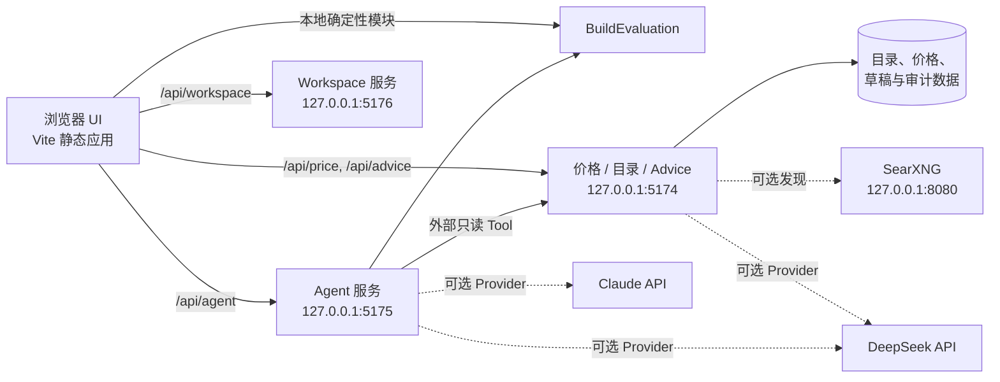

# Build Sim

[English](./README.md) | [简体中文](./README.zh-CN.md)

Build Sim 是一个重视证据边界的 PC / NAS 装机模拟平台。它在同一个浏览器应用中整合了精确 SKU 配置、确定性兼容性检查、空间占用、线缆路由、装配顺序、散热与噪音估算、可审计价格快照、受治理的官网目录补全，以及可选的 Provider-neutral AI Agent。

当前 `0.2.0-alpha` 版本聚焦于 JONSBO N6，参考路径为 ASUS Pro WS W680M-ACE SE 与 Intel Core i5-14500。架构已经为更多机箱和通用桌面装机预留扩展能力，但这些配置档案目前尚未交付。

> Build Sim 是规划工具，不是厂商 CAD、CFD、电气认证，也不能替代最新官方手册。重建几何、估算风量、市场候选、OCR 结果和 AI 回复始终与官方事实分开呈现。

## 目录

- [项目状态](#项目状态)
- [平台功能](#平台功能)
- [系统架构](#系统架构)
- [运行要求](#运行要求)
- [快速开始](#快速开始)
- [完整本地部署](#完整本地部署)
- [生产环境部署](#生产环境部署)
- [配置说明](#配置说明)
- [平台使用方法](#平台使用方法)
- [API 概览](#api-概览)
- [数据、证据与安全](#数据证据与安全)
- [测试与验证](#测试与验证)
- [仓库结构](#仓库结构)
- [当前限制与路线图](#当前限制与路线图)
- [参与贡献与许可证](#参与贡献与许可证)

## 项目状态

Build Sim 当前可作为本地 Alpha 版本使用，仍在持续开发中。

| 领域 | 当前状态 |
| --- | --- |
| 确定性装机评估 | 已实现，由 UI、Advice 服务和 Agent Tool 共用 |
| 方案生命周期工作台 | 已实现：创建、自动保存、复制、切换、不可变版本、恢复、软删除与离线缓存 |
| 方案关联交易与装机任务 | 已实现精确部件关联、稳定任务 sourceRef、reconcile 与可追溯清单导出 |
| evidence-aware Three.js 场景 | 已实现问题、走线、尺寸、规划热场与装配工作流，并保留 SVG fallback |
| JONSBO N6 几何、适配、接线、路由与装配 | 已在当前机箱配置中实现 |
| 散热、噪音、功耗与价格规划 | 已实现，并明确标注估算和证据边界 |
| 价格与官网目录服务 | 已实现，为仅绑定回环地址的本地服务 |
| DeepSeek Advice 与 Agent 适配器 | 已实现，已通过有边界的真实 DeepSeek 冒烟验证 |
| Claude 适配器 | 已通过协议 fixture；尚无真实 Provider 验收证据 |
| 受治理的目录写入 | 已实现一个审批绑定的写 Tool；默认关闭写入 |
| 公网多用户托管 | 尚未就绪：未包含认证、租户隔离和应用级限流 |
| 完整应用容器部署 | `deploy/osaka/` 已包含 Web、Price/Advice、Agent 与 SearXNG Compose；尚无 Kubernetes 清单 |
| 开源许可证 | 当前没有 `LICENSE` 文件；公开发布前必须处理 |

## 平台功能

### 确定性装机模型

- 精确 SKU 目录由 `data/skus/catalog.json` 提供。
- 统一的 `BuildEvaluation` 结果驱动兼容性、功耗、散热、噪音、价格、物理适配和校准视图。
- 体积 AABB 占用检查使用 `data/cases/jonsbo-n6/geometry.json` 中统一的机箱局部毫米坐标系。
- 证据感知的判定规则不会把重建锚点表述成厂商实测几何。
- 支持配置 JSON 导入和导出，便于复现与分享装机方案。

### 空间适配与装配

- 显示部件规划包络、机箱舱室、硬盘托架、背板、PSU 支架和可拆风扇支架。
- 检查显卡、散热器、电源、内存、硬盘及连接器净空。
- 根据安装依赖、进入走廊与插头操作空间推导装配顺序。
- 官方手册明确给出的步骤与几何推导步骤分开标记。

### 接线与线缆路由

- 提供逐盘数据路径、背板供电、线缆清单和模组电源插座规划。
- 按真实端口数量安排 HBA / 主板连接，并分别统计 SFF-8643 与 SFF-8654 线缆。
- 使用航点图求解走线路径，检查长度、装配余量、方向、穿孔和操作空间。
- 可在空间视图中选中并单独显示某条线缆折线。

### 散热、噪音与功耗

- 根据热负载和有效风量估算分舱空气温升。
- 部件热场与 UI 使用同一份确定性评估结果。
- 硬盘仓与下舱耦合是有边界的规划估算，不是 CFD。
- 功耗预算、风扇规划和噪音估算都会同时展示假设条件。

### 价格与官网目录

- `data/prices/` 保存可审计、带日期的价格快照。
- 提供京东、淘宝、拼多多、Amazon 和官网页面的本地候选采集流程。
- 支持候选发现、详情页规格检查、合理性门禁和显式人工确认。
- 具备可信官网域名注册表、SSRF 防护、重定向与响应体上限、HTML / JSON-LD / 规格表 / PDF 提取、可选扫描 PDF OCR 和字段级来源记录。
- 未知官网域名会进入提案状态；搜索候选、待审草稿和正式目录事实保持为不同阶段。

### Advice 与 Agent

- 可选 DeepSeek 结构化装机建议，并在本地记录 usage 和费用估算审计。
- Provider-neutral 流式多轮 Agent，支持本地会话持久化、取消、Skills、Tools、定义哈希和可校验审计记录。
- 当前包含 4 个确定性只读 Tool、4 个外部只读 Tool，以及 1 个受治理的写 Tool：`enrich_official_catalog`。
- 内置四个 Skill：`build-diagnosis`、`upgrade-advisor`、`shopping-research`、`assembly-and-wiring`。
- Tool schema、运行预算、Skill 可用 Tool、回环服务边界和带外写审批均由服务端执行，而不是只依赖 Prompt。

### 浏览器界面

当前界面包含七个按方案隔离的主要工作区：

1. **工作台**：创建、复制、切换、归档、恢复独立方案，并查看下一步任务。
2. **方案编辑与评估**：编辑 active draft，保存绑定 hash 的不可变版本。
3. **空间视图**：查看 evidence-aware Three.js 场景、问题、走线、尺寸、规划热场和装配步骤；SVG 为 fallback。
4. **采购与交易**：审阅 staged OCR、关联精确方案部件、归档证据并执行隐私删除。
5. **装机执行**：按稳定 sourceRef reconcile 采购、装配、接线和验证任务。
6. **Agent**：读取 active plan/3D/评估/采购/任务上下文并提出 allowlist 修改；只有明确人工批准才能修改草稿。
7. **Legacy 详情面板**：通过有边界的兼容 adapter 保留散热、接线、GPU、价格和检查清单细节。

## 系统架构



前端、价格服务和 Agent 服务是三个独立进程。开发时由 Vite 代理 API；生产环境应把 `dist/` 作为静态文件发布，并只将选定的 API 路径代理到两个回环 Node.js 服务。

## 运行要求

- Node.js 20 或更高版本。
- npm，并使用与 lockfile 一致的 `npm ci`。
- 现代浏览器。
- 本地开发可选、Osaka 部署必需：Docker 与 Compose。
- 可选：Playwright Chromium，用于有界面的市场采集和浏览器冒烟测试。
- 可选：服务端 DeepSeek 或 Claude 凭据。严禁放入 `VITE_` 环境变量。

## 快速开始

```bash
git clone <你的-fork-或仓库地址> build-sim
cd build-sim
npm ci
cp .env.example .env.local
```

在第二个终端启动 workspace 服务，然后打开 `http://127.0.0.1:5173`：

```bash
npm run workspace:serve
npm run dev
```

确定性模拟器不需要 AI Key。

需要价格或 Agent 功能时，在独立终端启动：

```bash
npm run price:serve
npm run agent:serve
```

只有配置 Provider 并设置 `BUILD_SIM_AGENT_ENABLED=true` 后，Agent 才会启用。

## 完整本地部署

### 1. 安装和配置

```bash
npm ci
cp .env.example .env.local
```

配置按每个 key 独立合并，优先级为：

```text
process.env > .env.local > .env > .env.example
```

高优先级显式空值表示清空，不会继续读取低优先级旧值。`.env.local` 已被 Git 忽略，必须保持私密。

### 2. 启动价格、目录与 Advice 服务

```bash
npm run price:serve
```

默认监听 `127.0.0.1:5174`。价格快照和确定性目录功能不需要 AI Provider。

如需启用 DeepSeek Advice，编辑 `.env.local`：

```dotenv
DEEPSEEK_ENABLED=true
BUILD_SIM_ADVICE_ENABLED=true
DEEPSEEK_API_KEY=<服务端密钥>
```

不要给 Key 添加 `VITE_` 前缀。真实 Provider 调用可能产生费用。应用记录 token usage 和本地费用估算，但它不等于 Provider 的实际账单或账户余额。

交易截图默认使用 DeepSeek 公共视觉模型，并复用服务端的 `DEEPSEEK_API_URL` 和 `DEEPSEEK_API_KEY`；以下 OCR 专用变量填写后会覆盖共用配置：

```dotenv
TRANSACTION_OCR_PROVIDER=deepseek-ocr
DEEPSEEK_OCR_API_URL=
DEEPSEEK_OCR_MODEL=deepseek-v4-flash-vision-exp
DEEPSEEK_OCR_API_KEY=
```

截图只发送到服务端配置的 DeepSeek 地址，不写入目录；应用仅保存内容哈希、脱敏摘要、识别引擎、provider usage 与本地费用估算。OCR 不可用时请求会明确失败，不会静默换引擎。仍可显式填写自托管 vLLM 地址并把模型设为 `deepseek-ai/DeepSeek-OCR`；需要回滚到本地英文识别时，设置 `TRANSACTION_OCR_PROVIDER=tesseract`。

### 3. 启动 Agent 服务

使用 DeepSeek 时：

```dotenv
BUILD_SIM_AGENT_ENABLED=true
DEEPSEEK_ENABLED=true
DEEPSEEK_API_KEY=<服务端密钥>
DEEPSEEK_AGENT_MODELS=deepseek-v4-flash,deepseek-v4-pro,deepseek-v4-flash-vision-exp
```

然后运行：

```bash
npm run agent:serve
```

使用 Claude 时还需要设置 `CLAUDE_ENABLED=true` 和 `CLAUDE_API_KEY`。Claude 为可选适配器，目前的验证边界是协议 fixture，而非真实 Provider 验收。

### 4. 启动前端

```bash
npm run dev
```

Vite 开发服务器读取同一份服务端口配置，并代理 Price / Advice 和 Agent 请求。所有应用服务固定绑定 `127.0.0.1`；端口冲突时会明确失败，不会静默换端口。

### 5. 可选：本地 SearXNG 发现

仓库中的 Compose 文件只用于 SearXNG，并不是完整应用容器：

```bash
npm run searxng:up
npm run searxng:health
npm run searxng:smoke
```

在 `.env.local` 中启用：

```dotenv
CATALOG_DISCOVERY_PROVIDER=searxng
SEARXNG_BASE_URL=http://127.0.0.1:8080
```

停止服务：

```bash
node scripts/searxng-local.mjs stop
```

搜索标题和摘要只能作为发现证据。只有可信最终 URL 被抓取、提取、审阅并通过目录门禁后，字段才可能成为正式事实。

### 6. 可选：扫描 PDF OCR

OCR 在本地运行，当前仅支持英文识别，具有严格资源上限，默认关闭，也不会直接把文本提升为正式目录事实：

```dotenv
CATALOG_PDF_OCR_ENABLED=true
CATALOG_PDF_OCR_MIN_TEXT_CHARS=80
CATALOG_PDF_OCR_MAX_PAGES=3
CATALOG_PDF_OCR_WIDTH=1600
CATALOG_PDF_OCR_TIMEOUT_MS=60000
```

OCR 字段会保留 OCR 来源并要求人工审阅。超出代码安全边界的配置会被拒绝。

### 7. 可选：市场浏览器

如果 Playwright 尚未下载 Chromium：

```bash
npx playwright install chromium
npm run price:login
```

登录配置保存在 `.cache/` 下，不得提交。使用者必须遵守各平台条款、访问限制和请求频率要求。

## 生产环境部署

仓库已经在 `deploy/osaka/` 提供完整的单机 Docker Compose 部署：构建静态 Web 镜像和共用 Node.js Runtime 镜像，然后运行 Web、Price/Catalog/Advice、Agent、Workspace 与固定摘要的 SearXNG 镜像。当前仍没有 Kubernetes 清单和自动公网部署流水线。

### Osaka Docker Compose 部署

当前配置约定仓库位于 `/home/linuxuser/Code/build-sim`。所有应用端口只监听回环地址，由宿主机 Nginx 负责 TLS 和访问控制。

#### 1. 准备目录与环境变量

```bash
sudo mkdir -p /home/linuxuser/Code
sudo chown linuxuser:linuxuser /home/linuxuser/Code
git clone <你的仓库地址> /home/linuxuser/Code/build-sim
cd /home/linuxuser/Code/build-sim

cp deploy/osaka/env.remote.example .env.remote
chmod 600 .env.remote
mkdir -p runtime deploy-backups
chmod 700 runtime
```

如果部署的是私有仓库或尚未提交的工作树，可以通过 SSH 同步源码，而不是直接 `git clone`；同步时排除 `.git`、`.env*`、`node_modules/`、`dist/` 以及运行时/审计数据，密钥文件另行复制并设置为 `600`。

在服务器上编辑 `.env.remote`，将 `SEARXNG_SECRET=<generate-on-server>` 替换为随机值，并确保 Provider Key 只保存在服务端。Compose 服务读取 `.env.remote`，不会读取宿主机 `.env.local`。如果要把本地 Provider 配置提升到远端，只合并 Provider 相关变量，不要覆盖远端端口、回环 URL 和运行目录。

启用 DeepSeek Advice 与 Agent 至少需要：

```dotenv
DEEPSEEK_ENABLED=true
BUILD_SIM_ADVICE_ENABLED=true
BUILD_SIM_AGENT_ENABLED=true
DEEPSEEK_API_KEY=<服务端密钥>
```

Provider 请求可能把装机或会话数据发送给外部服务并产生费用。复制 Key 不能证明 Provider 已连通；应在单独授权后，用一次有边界的真实请求完成验收。

#### 2. 构建并启动

在仓库根目录执行：

```bash
docker compose -f deploy/osaka/compose.yaml config --quiet
docker compose -f deploy/osaka/compose.yaml build
docker compose -f deploy/osaka/compose.yaml up -d
docker compose -f deploy/osaka/compose.yaml ps
```

Compose 使用以下回环监听地址：

| 服务 | 监听地址 |
| --- | --- |
| Web 容器 | `127.0.0.1:15176` |
| Price / Catalog / Advice | `127.0.0.1:5174` |
| Agent | `127.0.0.1:5175` |
| Workspace / 方案仓库 | `127.0.0.1:5176` |
| SearXNG | `127.0.0.1:18080` |

#### 3. 配置 Nginx 与 HTTPS

仓库包含签发证书用的临时 HTTP 配置，以及最终 TLS 反向代理：

```bash
sudo cp deploy/osaka/nginx-build-sim-http.conf /etc/nginx/sites-available/build-sim
sudo ln -sfn /etc/nginx/sites-available/build-sim /etc/nginx/sites-enabled/build-sim
sudo nginx -t
sudo systemctl reload nginx

sudo certbot certonly --nginx -d build-sim.66-245-218-148.sslip.io
sudo htpasswd -c /etc/nginx/.htpasswd-build-sim buildsim
sudo chown root:www-data /etc/nginx/.htpasswd-build-sim
sudo chmod 640 /etc/nginx/.htpasswd-build-sim

sudo cp deploy/osaka/nginx-build-sim.conf /etc/nginx/sites-available/build-sim
sudo nginx -t
sudo systemctl reload nginx
```

最终代理只开放 UI、Price/Advice/Agent、目录搜索轮询与候选补全接口；其他 `/api/catalog/` 管理接口返回 `404`。示例域名绑定当前 Osaka 地址；部署到其他主机时，必须同步修改 `server_name` 与证书路径。

#### 4. 验证、更新与停止

```bash
curl --fail http://127.0.0.1:15176/healthz
curl --fail http://127.0.0.1:5174/api/price/health
curl --fail http://127.0.0.1:5175/api/agent/health
curl --fail http://127.0.0.1:5176/api/workspace/plans
docker compose -f deploy/osaka/compose.yaml logs --tail=100
```

同步新代码或修改 `.env.remote` 后：

```bash
docker compose -f deploy/osaka/compose.yaml build
docker compose -f deploy/osaka/compose.yaml up -d --force-recreate
```

停止服务但保留绑定挂载的 `runtime/` 数据：

```bash
docker compose -f deploy/osaka/compose.yaml down
```

健康接口只证明进程和代理层工作。正式声称 Provider 交付正常前，还要验证带认证的公网入口、一次确定性装机评估、持久化，以及在明确授权后执行的一次有边界 Provider 请求。

### 手动 systemd 部署（备选）

#### 1. 构建产物

```bash
npm ci
npm run test
npm run build
```

构建结果：

- `dist/`：前端静态文件。
- `dist-agent/agent-server.js`：Agent 服务 bundle。
- Price / Catalog / Advice 服务直接运行 `scripts/price-server/server.mjs`。

`npm run preview` 适合本地检查前端构建，但不是生产 API 网关。

#### 2. 目录与环境

下面示例使用 `/opt/build-sim`：

```bash
sudo mkdir -p /opt/build-sim
sudo chown "$USER" /opt/build-sim
git clone <你的仓库地址> /opt/build-sim
cd /opt/build-sim
npm ci
cp .env.example .env.local
npm run build
```

生产密钥和功能开关放入 `/opt/build-sim/.env.local` 或服务管理器环境。服务的 `WorkingDirectory` 必须是项目根目录，确保统一 env loader 能定位配置文件和相对数据路径。

#### 3. systemd 服务

Price / Catalog / Advice：

```ini
# /etc/systemd/system/build-sim-price.service
[Unit]
Description=Build Sim Price Catalog and Advice Service
After=network.target

[Service]
Type=simple
User=build-sim
Group=build-sim
WorkingDirectory=/opt/build-sim
ExecStart=/usr/bin/node scripts/price-server/server.mjs
Restart=on-failure
RestartSec=3
NoNewPrivileges=true
PrivateTmp=true

[Install]
WantedBy=multi-user.target
```

Agent：

```ini
# /etc/systemd/system/build-sim-agent.service
[Unit]
Description=Build Sim Agent Service
After=network.target build-sim-price.service

[Service]
Type=simple
User=build-sim
Group=build-sim
WorkingDirectory=/opt/build-sim
ExecStart=/usr/bin/node dist-agent/agent-server.js
Restart=on-failure
RestartSec=3
NoNewPrivileges=true
PrivateTmp=true

[Install]
WantedBy=multi-user.target
```

创建专用 `build-sim` 用户并设置目录权限后：

```bash
sudo systemctl daemon-reload
sudo systemctl enable --now build-sim-price build-sim-agent
sudo systemctl status build-sim-price build-sim-agent
```

如果没有启用 Agent，不要启动或暴露 Agent unit。

#### 4. Nginx 静态托管与 API 代理

```nginx
server {
    listen 443 ssl http2;
    server_name build-sim.example.com;

    root /opt/build-sim/dist;
    index index.html;

    location / {
        try_files $uri $uri/ /index.html;
    }

    location /api/price/ {
        proxy_pass http://127.0.0.1:5174;
        proxy_set_header Host $host;
        proxy_set_header X-Forwarded-Proto $scheme;
    }

    location /api/advice/ {
        proxy_pass http://127.0.0.1:5174;
        proxy_set_header Host $host;
        proxy_set_header X-Forwarded-Proto $scheme;
    }

    location /api/agent/ {
        proxy_pass http://127.0.0.1:5175;
        proxy_http_version 1.1;
        proxy_buffering off;
        proxy_read_timeout 300s;
        proxy_set_header Host $host;
        proxy_set_header X-Forwarded-Proto $scheme;
    }
}
```

不要把 `/api/catalog/` 管理和写入接口暴露到不可信网络。公网托管前，必须在反向代理或可信网关增加认证、授权、必要的租户隔离、请求体限制、限流、TLS、安全响应头、日志轮转、备份和监控。应用当前按可信本地 / 单用户环境设计。

#### 5. 生产检查

```bash
curl --fail http://127.0.0.1:5174/api/price/health
curl --fail http://127.0.0.1:5175/api/agent/health
curl --fail https://build-sim.example.com/
```

还应通过公网域名实际执行一次装机评估；启用 Agent 时再执行一个有边界的 Agent 请求。进程健康不代表代理、密钥、持久化或 Provider 调用已经正常。

## 配置说明

### 端口

| 变量 | 默认值 | 所属服务 |
| --- | ---: | --- |
| `WEB_SERVER_PORT` | `5176` | Vite 开发服务器 |
| `WEB_PREVIEW_PORT` | `4173` | Vite preview |
| `PRICE_SERVER_PORT` | `5174` | Price / Catalog / Advice 及其调用方 |
| `AGENT_SERVER_PORT` | `5175` | Agent 服务与 Vite 代理 |

以上都是本地默认值，不代表公网监听；应用服务绑定回环地址。

### Provider 与 Agent 预算

完整变量见 [`.env.example`](./.env.example)，主要包括：

- `DEEPSEEK_*`、`CLAUDE_*` 及服务端 API Key。
- `BUILD_SIM_ADVICE_ENABLED` 与 `BUILD_SIM_AGENT_ENABLED`。
- `AGENT_MAX_MODEL_TURNS`、`AGENT_MAX_TOOL_CALLS`、重复调用、结果体积、消息长度和请求体上限。
- `AGENT_SESSION_ROOT`、`AGENT_AUDIT_ROOT` 与 `BUILD_SIM_SKILLS_ROOT`。

### 官网目录控制

- `BUILD_SIM_CATALOG_WRITE_ENABLED=false` 是默认总写入门禁。
- `CATALOG_AUTO_ACCEPT_EXACT_MPN=false` 默认使精确 MPN 候选停留在审阅阶段。
- `CATALOG_AUTO_TRUST_NEW_DOMAINS=true` 会被拒绝；新域名必须走受治理审批。
- `CATALOG_FETCH_*` 和 `CATALOG_PDF_OCR_*` 不能突破代码内安全上限。
- `CATALOG_PERSIST_ROOT` 决定持久化根目录；启用写入前要确保可写并做好备份。

### 持久化路径

| 路径 | 用途 | Git 状态 |
| --- | --- | --- |
| `data/prices/` | 版本化价格快照 | 跟踪 |
| `data/agent/sessions/` | 本地多轮消息历史 | 忽略 |
| `data/agent/audit/` | 带完整性校验的 Agent 审计 | 忽略 |
| `data/audit/` | Advice 与目录运行记录 | 忽略 |
| `.cache/price-browser-profile/` | 市场浏览器登录配置 | 忽略 |

会话历史为了恢复对话，会包含消息与 Tool 正文；审计文件则尽量只保存哈希和结构化元数据，不复制 Prompt、模型正文或密钥。两类目录都应按应用数据保护。

## 平台使用方法

### 配置和评估装机方案

1. 打开“装机预览”。
2. 为主板、CPU、散热器、内存、电源、显卡、存储、HBA 和风扇选择精确 SKU。
3. 查看统一 FIT 结论和每条冲突 / 警告。
4. 比较替代方案前导出配置 JSON，之后可导入并复现同一方案。

### 查看散热和接线

1. 在“热量与噪音”中结合已显示的假设查看舱室和部件估算。
2. 在“1–9 盘接线”中检查逐盘数据路径、背板供电和 PSU 插座。
3. 选择某条线缆，在空间视图中单独显示其路径。
4. 使用“装机顺序”，并区分官方手册步骤和推导步骤。

### 使用价格功能

1. 启动 `npm run price:serve`。
2. 打开“价格与配件”。
3. 把搜索卡片价格视为线索，而不是已审计价格。
4. 检查详情页规格并确认精确选项后，再持久化报价。
5. 需要时运行 `npm run price:refresh` 重建最新快照。

Amazon 美元价格使用明确汇率，并保持为参考价格。UI 不会把快照冒充实时市场价或历史价格序列。

### 请求结构化 Advice

1. 启用并启动 Price / Advice 服务。
2. 在“价格与配件”中提交当前 `BuildEvaluation`。
3. 将 AI 建议与确定性警告和来源信息一起审阅；AI 文本不能替代评估引擎。
4. 可通过 `GET /api/advice/billing?limit=100` 查看本地 usage 和费用估算。

### 使用 Agent

1. 启用并启动 Agent；使用外部只读 Tool 时还要启动 Price 服务。
2. 在“装机预览”选择可用模型和四个 Skill 之一。
3. 创建会话，提出与当前装机相关的问题，并检查 Tool 结果、证据、定义哈希、usage 与本次运行的本地费用估算。
4. 必要时从 UI 取消运行。会话会保存在本地，直到通过合适的维护流程清理文件。

浏览器不会收到 Provider API Key。Fixture 输出会明确标注，不能作为真实 Provider 可用性的证据。

### 受治理的官网目录补全

补全流程按阶段推进：

```text
发现候选 -> 可信最终页面抓取 -> 字段提取 -> 待审草稿 -> 批准写入
```

- 搜索摘要不会直接成为事实。
- 未知域名进入提案，不会自动成为可信来源。
- 字段冲突、访问拦截、稀疏 PDF 和 OCR 输出均要求审阅。
- 正式写入要求开启总写入开关和相应验收门禁。
- Agent 写入还需要短时效带外审批信封，精确绑定 Tool 定义、会话、输入哈希、幂等键、备份目标和回滚策略。
- 目录写入产生备份与回滚清单；提交前必须检查实际 diff。

## API 概览

### Price / Catalog / Advice 服务

| 方法 | 路径 | 用途 |
| --- | --- | --- |
| `GET` | `/api/price/health` | 服务健康检查 |
| `GET` | `/api/price/state` | 采集器和快照状态 |
| `POST` | `/api/price/collect` | 采集价格候选 |
| `POST` | `/api/price/variants` | 检查商品规格 |
| `POST` | `/api/price/audit` | 确认并保存已审计报价 |
| `POST` | `/api/price/rebuild` | 重建最新快照 |
| `POST` | `/api/advice/build` | 创建结构化装机建议任务 |
| `GET` | `/api/advice/build/:id` | 读取 Advice 任务 |
| `GET` | `/api/advice/billing` | 读取本地 usage / 费用估算 |
| `POST` | `/api/catalog/search` | 发现官网候选 |
| `GET` | `/api/catalog/search/:id` | 读取发现任务 |
| `POST` | `/api/catalog/inspect` | 抓取并检查候选 |
| `GET` | `/api/catalog/domain-proposals` | 列出未知域名提案 |

其余提案、草稿和接受接口属于管理接口。请保持私有，并在接入自动化前以实现和测试为准。

### Agent 服务

| 方法 | 路径 | 用途 |
| --- | --- | --- |
| `GET` | `/api/agent/health` | 服务与 Provider 可用性 |
| `POST` | `/api/agent/evaluate` | 服务端确定性评估 |
| `GET` | `/api/agent/models` | 可用 Provider 模型 |
| `GET` | `/api/agent/tools` | Tool 清单与定义哈希 |
| `GET` | `/api/agent/skills` | Skill 清单与定义哈希 |
| `POST` | `/api/agent/sessions` | 创建本地会话 |
| `GET` | `/api/agent/sessions/:id` | 读取会话 |
| `POST` | `/api/agent/sessions/:id/messages` | 发起消息运行 |
| `GET` | `/api/agent/runs/:id/events` | SSE 流式事件 |
| `POST` | `/api/agent/runs/:id/cancel` | 取消运行 |
| `GET` | `/api/agent/runs/:id/audit` | 读取结构化审计记录 |

这些 API 仍属于 Alpha 契约，稳定版之前可能变化。

## 数据、证据与安全

- 官方、实测、重建、估算、合成 fixture、OCR 和真实 Provider 证据是不同类别。
- 缺失或冲突的数据保持 `unknown`，不得为填补空白而虚构精确数值。
- 官网 URL 抓取执行可信域名、DNS / IP 检查、重定向上限、响应体上限和 SSRF 防护。
- Provider 凭据只保存在服务端环境中，不进入浏览器变量。
- Agent Tool 输入输出经过 schema 和预算限制；Skill `allowedTools` 在实际派发时再次执行。
- 审计文件会脱敏 Key / Bearer 模式并包含完整性哈希，但部署者仍需负责文件权限、备份、保留策略和事件响应。
- 注册表摘要只能证明一次目录变更被记录，不能证明部署、Provider 或 UI 已健康。

修改证据或发布语义前，请阅读 [docs/PROVENANCE.md](./docs/PROVENANCE.md)、[docs/PRICE_SNAPSHOTS.md](./docs/PRICE_SNAPSHOTS.md) 和 [docs/agent-implementation-matrix.md](./docs/agent-implementation-matrix.md)。

## 测试与验证

核心检查：

```bash
npm test
npm run typecheck
npm run build
npm run agent:secret-scan
```

浏览器验收依赖相应本地服务和 Playwright 浏览器：

```bash
npm run test:g1:browser
npm run test:g7:browser
npm run test:workspace:browser
npm run test:spatial:browser
npm run test:agent-plan:browser
npm run test:transactions:browser
npm run test:build-tasks:browser
npm run test:platform:browser
npm run test:c7:browser
```

Provider 与发现链路检查：

```bash
npm run agent:fixture
npm run searxng:smoke
BUILD_SIM_AGENT_LIVE_SMOKE=1 npm run agent:live-smoke
```

Live smoke 会发送真实 Provider 请求并可能产生费用；fixture 只能证明协议行为。

价格维护命令：

```bash
npm run price:search
npm run price:refresh
npm run price:fixture
```

## 仓库结构

```text
index.html                 最小 Vite 应用壳
src/lab/app-document.html  惰性加载的 legacy-compatible N6 详情模板
src/plans/                 方案契约、repository/client store、评估快照、提案与任务 reconcile
src/core/                  评估、几何、策略、散热、路由、装配
src/lab/                   浏览器启动与 view-model 集成
src/server/                Agent HTTP 服务与确定性领域 Tool
src/server/workspace-*     回环 workspace API 与提案/上下文审计边界
src/wiring/                接线与 PSU 插座规划
src/price/                 快照合并、匹配、查询与合理性门禁
src/adapters/jonsbo-n6/    JONSBO N6 机箱适配层
data/skus/                 精确 SKU 目录
data/cases/jonsbo-n6/      几何、路由、装配与机箱素材
data/prices/               已审计的日期快照与 latest 快照
data/catalog/              可信官网域名注册表和目录状态
scripts/price-server/      Price / Catalog / Advice 回环服务
scripts/price-refresh/     快照重建与离线搜索辅助
scripts/searxng-local.mjs  可选本地 SearXNG 生命周期工具
skills/                    Agent Skills 与清单
infra/searxng/             可选 SearXNG Docker Compose
deploy/osaka/              完整单机 Docker Compose 与 Nginx 部署配置
tests/                     确定性、协议、安全和浏览器测试
docs/                      来源、路线图、设计与执行证据
legacy/v1/                 冻结的 V1 参考实现
```

## 当前限制与路线图

- 当前仅交付 JONSBO N6 机箱配置。
- 规划几何不是厂商 CAD，热场也不是 CFD。
- 价格采集受第三方页面、登录、区域可用性和平台条款影响。
- 交易截图 OCR 默认使用实验版 DeepSeek 公共视觉模型；其可用性和价格可能变化，OCR 结果仍只能生成待审证据。自托管 DeepSeek-OCR 为可选方案，Osaka Compose 不内置该模型服务。
- Claude 具有 fixture 证据，但当前仓库状态没有已验收的真实 Provider 证据。
- 尚未实现公网认证、授权、租户隔离和应用级限流。
- Legacy 详情 markup/runtime 仍位于明确的浏览器兼容 adapter 后；PlanStore 与 BuildEvaluation 已是权威源，完整框架/模板重写有意延后。
- Osaka Docker 配置是单机且部署专用的；尚无 Kubernetes 清单和自动公网部署流水线。
- 历史价格序列、实测校准、产品纹理映射和更多硬件档案仍是后续工作。

路线图见 [docs/ROADMAP.md](./docs/ROADMAP.md)。

## 参与贡献与许可证

仓库所有者发布贡献和治理政策后，欢迎提交 Issue 和范围清晰的 Pull Request。修改应遵守以下规则：

1. 行为变化应补充或更新确定性测试。
2. 保持单一权威事实源，不在 UI 文案中复制硬编码数值。
3. 保留来源信息，区分官方、推断、估算、OCR、fixture 和真实证据。
4. Provider 密钥只留在服务端，写能力默认关闭。
5. 声称完成前运行核心检查和相关浏览器 / 服务冒烟测试。

当前仓库**没有 `LICENSE` 文件**。仅能看到源代码并不等于获得开源软件通常授予的使用、修改和再分发权利。在作为开源项目正式发布前，仓库所有者应选择 OSI 批准的许可证，添加许可证全文和版权声明，并确认依赖、素材、数据许可及贡献指南保持一致。本 README 不代替所有者选择许可证。
